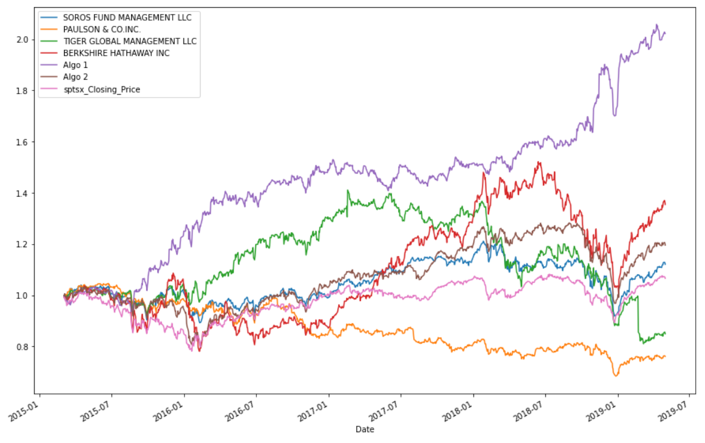
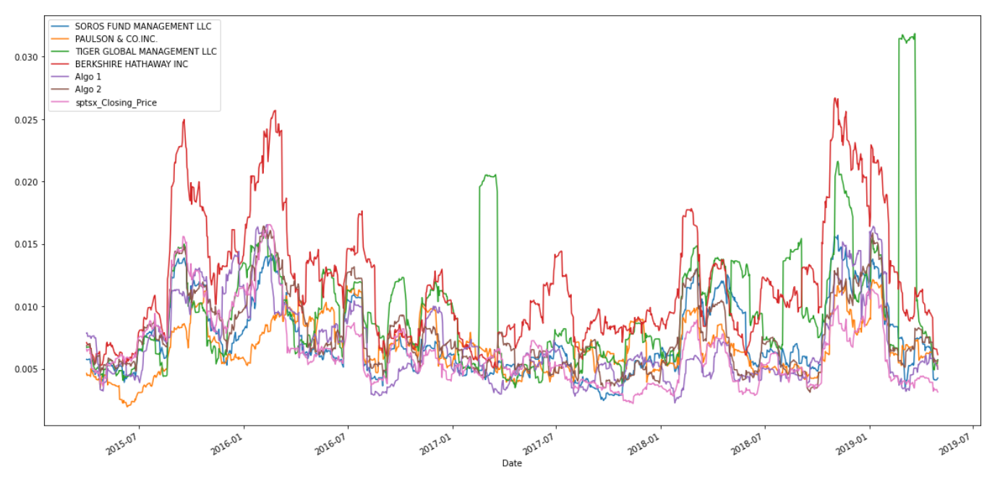

# Homework_4_Pandas
#### This project is completed for Fintech Bootcamp Fall 2021. 
#### Vincent Xin Wen

# Homework Background

Harold's company has been investing in algorithmic trading strategies. Some of the investment managers love them, some hate them, but they all think their way is best.

You just learned these quantitative analysis techniques with Python and Pandas, so Harold has come to you with a challenge—to help him determine which portfolio is performing the best across multiple areas: volatility, returns, risk, and Sharpe ratios.

You need to create a tool (an analysis notebook) that analyzes and visualizes the major metrics of the portfolios across all of these areas, and determine which portfolio outperformed the others. You will be given the historical daily returns of several portfolios: some from the firm's algorithmic portfolios, some that represent the portfolios of famous "whale" investors like Warren Buffett, and some from the big hedge and mutual funds. You will then use this analysis to create a custom portfolio of stocks and compare its performance to that of the other portfolios, as well as the larger market ([S&P TSX 60 Index](https://en.wikipedia.org/wiki/S%26P/TSX_60)).

# Main goals of the project
1. Read in and Wrangle Returns Data

2. Determine Success of Each Portfolio

3. Choose and Evaluate a Custom Portfolio

### The cumulative return of the portfoilo is as follow

we can see the BERKSHIRE HATHAWAY INC and Algo 1 outperform the S&P 500 and by using box plot we can see that  - TIGER GLOBAL MANAGEMENT LLC has the Largest spread and PAULSON & CO.INC has the smallest spread.

Using the standard deviation of each portfolio we know that TIGER GLOBAL MANAGEMENT LLC and BERKSHIRE HATHAWAY INC are riskier than the S&P 500.

### The rolling std for all portfolios with 21-day window is as follow

Almost all the stock's risk increases at the same time with S&P Tsx  except Tiger Global Management LLC.Also the Algo 2 and SOROS FUND MANAGEMENT LLC's return are most closely followed S&P Tsx.

### The sharpe ratio for all portfolio is shown below
#### From the box plot we can see portfolios are having relatively low ration except the Alog1.

## In terms of my own portfoilo, I used shop, ostx and l as provided.

* `SHOP` - [Shopify Inc](https://en.wikipedia.org/wiki/Shopify)

* `OTEX` - [Open Text Corporation](https://en.wikipedia.org/wiki/OpenText)

* `L` - [Loblaw Companies Limited](https://en.wikipedia.org/wiki/Loblaw_Companies)

Conculsion is that my portfolio is doing well compared with Whales and S&P 500, just like Algorithmic trading porfolios
